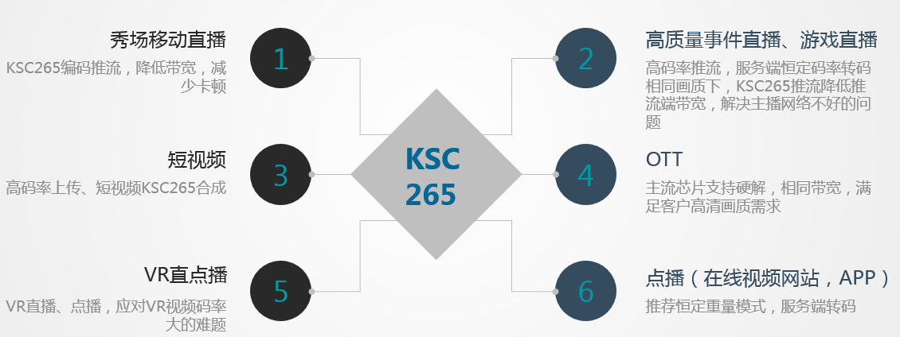

# H265

Maintainer: 金山   
Members：金山，网宿，星域，七牛   

## 1. Introduction
金山云KSC265是集编码、解码于一体的H.265编解码软件，完全遵循H.265协议标准。符合H.265编码规范的视频都可以通过KSC265进行解码，通过KSC265编码的视频都可以通过遵循H.265协议标准的解码器进行解码。KSC265无任何开源代码依赖，完全自主知识产权，专业的算法团队，在底层架构，汇编指令，算法优化方面持续进行优化，不断迭代，压缩率、编解码效率全面超越x265和openhevc。

* 在2016.8, 编码器V2.1版本，参加世界编码器大赛，综合评价结果中排名软件编码器第一。
* 2016.12,  编码器V2.4版本，在世界编码器大赛的4K编码赛事中，取得了压缩效率最优的成绩。是中国商用H.265视频编解码软件获取的最高国际荣誉。

本github主要交流KSC265在直播领域的应用使用，内容包括rtmp直播推流支持H.265编码，FFmpeg FLV针对H.265进行的扩展规范和相关patch。
### 2. FFmpeg 扩展

### 3. KSC265功能

* KSC265旨在通过技术优势转换成持续的成本优势，在有限的带宽下享受更高的画质，近一半的带宽下，相同的观看体验。
* 在编码方面，可配置7个编码速度级别，对应不同的编码场景。
* 编解码支持x86，x64，ARM32/64位架构，以及上面上主流操作系统。
* KSC265真正实现低码率高画质，在各种环境下，均实现相同画质下30%-50%的码率节省。尤其在移动端编码上拥有重大突破，为移动直播的H.265的落地扫清了技术障碍。
* 解码完备性强，在丢帧及多种网络丢包情况下仍然能成功解码播放，解码速度比openHEVC具有碾压性优势。

#### 3.1 应用场景说明

#### 3.2 体验与试用
KSC265 Demo体验
* iOS Demo

https://github.com/ksvc/ks265codec/tree/master/iOS_demo

* Android Demo

https://github.com/ksvc/ks265codec/tree/master/Android_demo

#### 3.3 金山移动直播App示范

开播-金山云已经集成了KSC265，Appstore和应用宝均有下载，可以快速下载试用。
 

